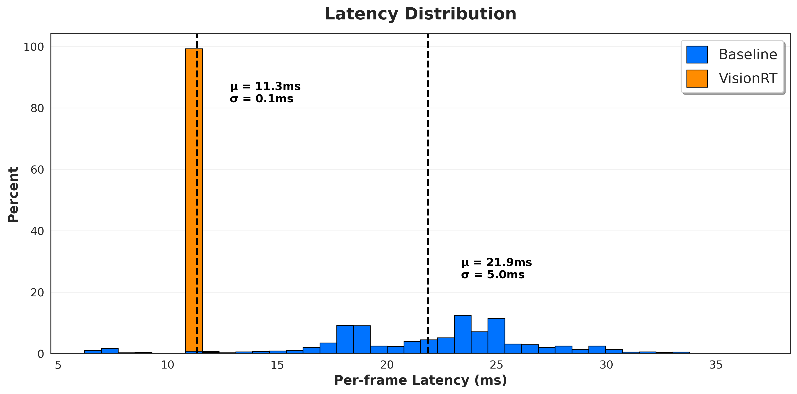

`visionrt` **- Zero-overhead real-time computer vision.**

Skip the overhead:
```python
from visionrt import Camera, Preprocessor
import visionrt

camera = Camera("/dev/video0")
model = visionrt.compile(model)

for frame in camera.stream():
    tensor = Preprocessor(frame)
    out = model(tensor)
```

So fast you can see your camera's true refresh rate:



The orange narrow peaks show `visionrt` is so deterministic that you can actually see the hardware. The bimodal distribution is the webcam itself, not software jitter.

---

### Install
```bash
uv pip install git+https://github.com/abiel-almonte/visionrt
```

> Requires CUDA 12.8+, Python 3.11, PyTorch 2.8, V4L2 compatible camera.  
> Add your user to the video group: `sudo usermod -aG video $USER`
